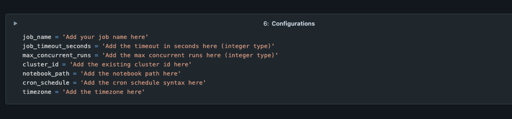

# Databricks Workflow PythonSDK Sample Project

### Introduction
This repository provides a comprehensive set of scripts for automating Databricks workflow jobs, leveraging the Databricks Python SDK. It includes examples and best practices for efficient job scheduling, management, and execution within the Databricks environment.

### How to use
Please upload all the files and notebooks to your `Databricks workspace`, and fill the configurations in the main notebook.

##### Main Notebook Configurations:
